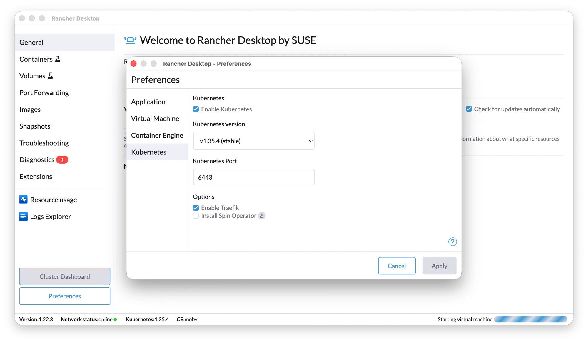

# Setup — get a cluster and a namespace

Do this **once** before the exercises. The goal: a working local cluster, `kubectl`
pointed at it, and your own namespace set as the default so you don't have to type
`-n <namespace>` on every command.

## 1. Get a local cluster

We use **Rancher Desktop** in this workshop — it's the same tool from Workshop #1,
and it ships a container runtime, `kubectl`, a Traefik ingress controller and a
`local-path` storage class out of the box.

- Install **Rancher Desktop** and enable Kubernetes in its settings.
- Make sure `~/.rd/bin` is on your `PATH` (so `kubectl` resolves to Rancher's).

### Enable Kubernetes in Rancher Desktop

Open **Preferences → Kubernetes** and match these settings:



- ✅ **Enable Kubernetes**.
- **Kubernetes version** — pick a recent **stable** release (the workshop was tested on
  `v1.35.4`). Anything reasonably current is fine.
- **Kubernetes Port** — leave the default **6443** (this is the API server port).
- ✅ **Enable Traefik** — this gives you the ingress controller you need in
  [module 4](../4-exposing-workloads/README.md). Leave it on.

Click **Apply** and wait for the status bar to finish "Starting virtual machine" /
show Kubernetes as running. First start pulls images and takes a few minutes.

> **Alternatives** (not the supported happy-path, but they work):
> - **kind** — `kind create cluster`. No ingress by default; you'd install one
>   (e.g. `ingress-nginx`) yourself. Storage class is `standard` (local).
> - **k3d** — `k3d cluster create`. Like Rancher, k3s-based, ships Traefik.
>
> If you use one of these, the only thing that really changes for these exercises
> is the ingress controller / ingress class in module 4.

## 2. Verify kubectl talks to the cluster

```bash
kubectl version            # client + server version
kubectl get nodes          # should list at least one Ready node
kubectl cluster-info
```

If `get nodes` shows a `Ready` node, you're in business.

> **Which cluster am I pointed at?** `kubectl config current-context`.
> Rancher Desktop's context is called `rancher-desktop`. If you have several
> clusters, switch with `kubectl config use-context <name>`.

## 3. Create your namespace

A **namespace** is a labelled fence around a group of resources. Working in your own
namespace keeps your nginx Pod from colliding with the person next to you, and lets
you delete everything in one shot at the end.

```bash
kubectl create namespace workshop
kubectl get namespaces
```

## 4. Set the namespace on your context (do this — it saves pain later)

By default `kubectl` talks to the `default` namespace, so every command would need
`-n workshop`. Instead, pin your namespace onto the **current context** once:

```bash
kubectl config set-context --current --namespace=workshop
```

Now `kubectl get pods` automatically means `kubectl get pods -n workshop`. Verify:

```bash
kubectl config view --minify | grep namespace:
# namespace: workshop
```

> **Why we make a point of this:** later slides and commands sometimes show an
> explicit `-n demo` / `-n pods`. Once you understand that `-n` just overrides the
> namespace for one command — and that your context already has a default — those
> flags stop being confusing. `-A` (or `--all-namespaces`) shows resources across
> *every* namespace, which is handy when you "lose" something.

## 5. Confirm storage and ingress are present

Module 3 (persistence) needs a default StorageClass; module 4 (exposing) needs an
ingress controller. Rancher Desktop ships both:

```bash
kubectl get storageclass
# local-path  ...  (default)

kubectl get pods -n kube-system | grep traefik
# traefik-...  Running
```

If `local-path` isn't marked `(default)`, module 3 tells you how to name it
explicitly. If you don't see Traefik (e.g. you're on kind), module 4 has a note.

## Teardown (after the workshop)

Deleting your namespace removes everything you created inside it:

```bash
kubectl delete namespace workshop
```
