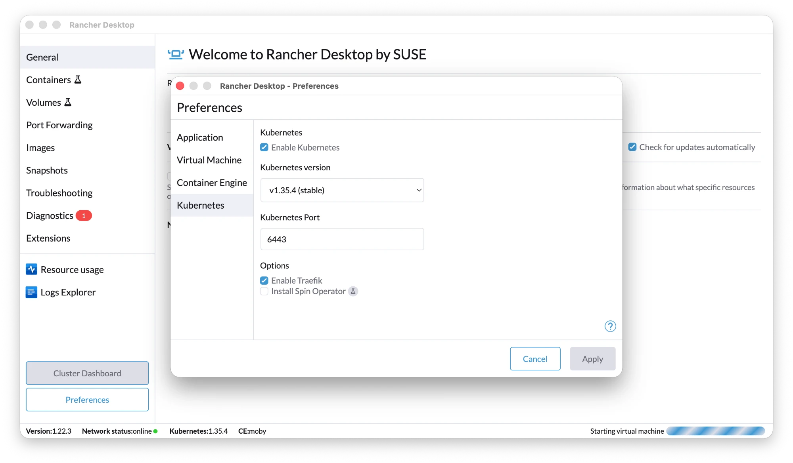

# Setup — a working local Kubernetes cluster

## 1. Get a local cluster
Here you have a choice of Rancher Desktop, https://k3d.io/ and https://kind.sigs.k8s.io/

We use **Rancher Desktop** in this workshop — it's the same tool from Workshop #1,
and it ships a container runtime, `kubectl`, a Traefik ingress controller and a
`local-path` storage class out of the box.

> **Alternatives** (not the supported happy-path, but they work):
> - **kind** — `kind create cluster`. No ingress by default; you'd install one
>   (e.g. `ingress-nginx`) yourself. Storage class is `standard` (local).
> - **k3d** — `k3d cluster create`. Like Rancher, k3s-based, ships Traefik.
>
> If you use one of these, the only thing that really changes for these exercises
> is the ingress controller / ingress class in module 4.

### Rancher Desktop

We use **Rancher Desktop** in this workshop — it's the same tool from Workshop #1,
and it ships a container runtime, `kubectl`, a Traefik ingress controller and a
`local-path` storage class out of the box.

1. Install **Rancher Desktop** and enable Kubernetes in its settings.
2. Make sure `~/.rd/bin` is on your `PATH` (so `kubectl` resolves to Rancher's).
3. Allow Rancher Desktop to bind port 80: `sudo sysctl -w net.ipv4.ip_unprivileged_port_start=80`

#### Enable Kubernetes in Rancher Desktop

Open **Preferences → Kubernetes** and match these settings:



- ✅ **Enable Kubernetes**.
- **Kubernetes version** — pick a recent **stable** release (the workshop was tested on
  `v1.35.4`). Anything reasonably current is fine.
- **Kubernetes Port** — leave the default **6443** (this is the API server port).
- ✅ **Enable Traefik** — this gives you the ingress controller you need in
  [module 4](../4-exposing-workloads/README.md). Leave it on.

Click **Apply** and wait for the status bar to finish "Starting virtual machine" /
show Kubernetes as running. First start pulls images and takes a few minutes.

### K3D
k3d is a lightweight wrapper to run k3s (Rancher Lab’s minimal Kubernetes distribution) in docker.

Install with `curl -s https://raw.githubusercontent.com/k3d-io/k3d/main/install.sh | bash`

Create a cluster with `k3d cluster create --agents 2  --port "127.0.0.1:80:80@loadbalancer"`

## 2. Verify kubectl talks to the cluster

```bash
kubectl version            # client + server version
kubectl get nodes          # should list at least one Ready node
kubectl cluster-info
```

If `get nodes` shows a `Ready` node, you're in business.

> **Which cluster am I pointed at?** `kubectl config current-context`.
> Rancher Desktop's context is called `rancher-desktop`. If you have several
> clusters, switch with `kubectl config use-context <name>`.

## 3. Confirm storage and ingress are present

Module 3 (persistence) needs a default StorageClass; module 4 (exposing) needs an
ingress controller. Rancher Desktop ships both:

```bash
kubectl get storageclass
# local-path  ...  (default)

kubectl get pods -n kube-system | grep traefik
# traefik-...  Running
```

If `local-path` isn't marked `(default)`, module 3 tells you how to name it
explicitly. If you don't see Traefik (e.g. you're on kind), module 4 has a note.
